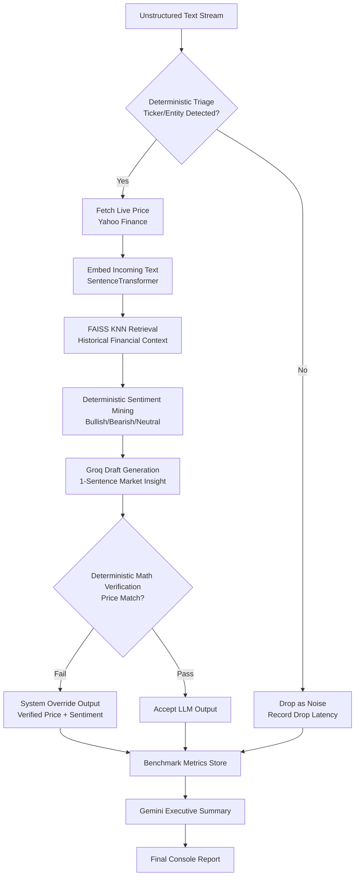

# LLM_AGENT

## Overview
This project implements a hybrid financial data mining pipeline for unstructured text streams. It combines deterministic logic, retrieval-augmented generation (RAG), and large language models (LLMs) to produce concise market insights while reducing hallucination risk with rule-based verification.

The implementation in this workspace is provided in `data_mining_agent.py`.

## Key Features
- Secure API key handling via environment variables, with masked runtime prompts as fallback.
- Heterogeneous model strategy:
  - Groq (Llama-3 family) for high-volume, low-latency stream inference.
  - Google Gemini for final macro-level executive synthesis.
- Historical data mining using Hugging Face dataset `zeroshot/twitter-financial-news-sentiment`.
- Unsupervised RAG pipeline using sentence-transformers embeddings + FAISS nearest-neighbor retrieval.
- Deterministic triage for rapid non-financial noise dropping (ticker/entity extraction + sentiment keyword scoring).
- O(1)-style deterministic numeric verification to catch price hallucinations.
- Automated benchmarking for throughput, latency overhead, and hallucination statistics.

## Technology Stack
- Python 3.10+
- `faiss-cpu`
- `numpy`
- `yfinance`
- `datasets` (Hugging Face)
- `sentence-transformers`
- `scikit-learn`
- `langchain-google-genai`
- `langchain-groq`

## Project Structure
- `data_mining_agent.py`: Main script (setup, mining, stream processing, validation, benchmarking, executive summary).
- `README.md`: Documentation and execution guide.

## Prerequisites
1. Python 3.10 or higher (your report may mention 3.14; script logic remains 3.10+ compatible).
2. Valid API keys:
   - Google Gemini API key
   - Groq API key
3. Internet connectivity (required for model APIs, Hugging Face data download, and live market data retrieval).

## Installation
Install dependencies:

```bash
pip install faiss-cpu numpy yfinance datasets sentence-transformers langchain-google-genai scikit-learn langchain-groq
```

## Configuration
Set API keys before execution (recommended).

### PowerShell (Windows)
```powershell
$env:GOOGLE_API_KEY="your_google_api_key"
$env:GROQ_API_KEY="your_groq_api_key"
```

### Bash (Linux/macOS)
```bash
export GOOGLE_API_KEY="your_google_api_key"
export GROQ_API_KEY="your_groq_api_key"
```

If keys are not found, the script securely prompts at runtime using `getpass`.

## How to Run
From the project directory:

```bash
python data_mining_agent.py
```

## Runtime Workflow
1. Initialize API clients and LLMs.
2. Load and embed historical sentiment data.
3. Build FAISS index for semantic retrieval.
4. Validate deterministic sentiment mining against ground-truth labels (`classification_report`).
5. Process high-velocity text stream:
   - Triage and drop non-financial noise
   - Extract ticker/entity
   - Fetch live market price (`yfinance`)
   - Generate draft insight (Groq)
   - Apply deterministic numeric verification
6. Compute pipeline benchmarks and hallucination statistics.
7. Generate final executive summary with Gemini.

## Dataflow


## Output Metrics
On completion, the script reports:
- Total, processed, and dropped stream items.
- Average triage/drop latency (saved API calls).
- Baseline LLM-only latency vs hybrid pipeline latency (including overhead percentage).
- Hallucinations caught and final hallucination rate for the run.

## Notes
- Live market retrieval depends on Yahoo Finance availability and symbol coverage.
- API latency and output quality vary with network conditions and provider load.
- For reproducible academic reporting, log execution time, package versions, and exact model versions.

## Author
Manab Biswas
