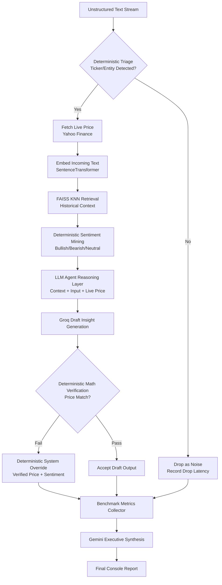

# LLM_AGENT

## Overview
This project implements a hybrid financial data mining pipeline for processing unstructured text streams. It combines deterministic logic, retrieval-augmented generation (RAG), and large language models (LLMs) to generate concise market insights while reducing hallucination risk through rule-based verification.

The implementation in this workspace is provided in `LLM_AGENT_FOR_DATA_MINING.ipynb`.

## Key Features
- **Secure API Key Handling:** Managed through environment variables and prompt-based input (`getpass` fallback).
- **Heterogeneous Model Strategy:** Uses Groq models (Llama-3 family) for high-volume, low-latency stream inference and Google Gemini for final macro-level executive synthesis.
- **Historical Data Mining:** Clusters and mines historical financial sentiment data from Hugging Face (`zeroshot/twitter-financial-news-sentiment`).
- **Unsupervised RAG:** FAISS-based semantic nearest-neighbor retrieval with sentence-transformers embeddings.
- **Sub-millisecond Triage:** Deterministic ticker/entity extraction and sentiment keyword scoring drop non-financial noise early.
- **Deterministic Verification:** Python regex + numeric consistency checks detect and prevent quantitative price hallucinations.
- **Automated Benchmarking:** Stream-processing outputs generate live metrics for throughput, latency overhead, and hallucination rates.

## Technology Stack
- **Language:** Python 3.10+
- **Vector Database:** FAISS (`faiss-cpu`)
- **Data APIs:** `yfinance`, Hugging Face `datasets`
- **Machine Learning / NLP:** `numpy`, `sentence-transformers`, `scikit-learn`
- **LLM Orchestration:** `langchain-google-genai`, `langchain-groq`

## Project Structure
- `LLM_AGENT_FOR_DATA_MINING.ipynb`: Main notebook containing setup, mining logic, stream processing, validation, and execution flow.
- `data_mining_agent.py`: Script version of the same pipeline logic.
- `README.md`: Project documentation and execution instructions.

## Prerequisites
- Python 3.10 or newer (Python 3.14 is also supported).
- Valid API keys:
  - Google Gemini API key
  - Groq API key
- Internet connectivity (required for model APIs, Hugging Face dataset download, and live market data retrieval).

## Installation
Install all required dependencies:

```bash
pip install faiss-cpu numpy yfinance datasets sentence-transformers langchain-google-genai scikit-learn langchain-groq
```

## Configuration
Set your API keys as environment variables before running the script.

### PowerShell (Windows)
```powershell
$env:GOOGLE_API_KEY="your_google_api_key"
$env:GROQ_API_KEY="your_groq_api_key"
```

### Bash (Linux/macOS)
```bash
export GOOGLE_API_KEY="your_google_api_key"
export GROQ_API_KEY="your_groq_api_key"
```

If these are not set, the script securely prompts for both keys at runtime using `getpass`.

## How to Run
### Option A: Notebook (Primary)
1. Open `LLM_AGENT_FOR_DATA_MINING.ipynb` in Jupyter/VS Code.
2. Run cells sequentially from top to bottom.
3. Provide API keys when prompted (if not already set in environment variables).

### Option B: Python Script (Alternative)
From the project directory:

```bash
python data_mining_agent.py
```

## How RAG Works with the LLM Agent
The LLM agent does not generate insights from raw stream text alone. It follows a retrieval-first workflow:

1. **User/Stream Input arrives** and is triaged for financial relevance.
2. **Embedding step:** Relevant text is converted into dense vectors using sentence-transformers.
3. **Retrieval step (FAISS):** The system retrieves top-K similar historical financial sentiment records.
4. **Context assembly:** Retrieved records + mined sentiment signals are packaged as grounded context.
5. **Agent generation step (Groq Llama-3):** The LLM agent produces a concise market brief using only the current input and retrieved evidence.
6. **Deterministic verification layer:** Regex/numeric checks validate the price claim; invalid outputs are replaced by a deterministic safe response.
7. **Executive agent synthesis (Gemini):** Final run-level macro summary is generated from verified pipeline metrics.

This design reduces hallucination risk by forcing the agent to reason over retrieved evidence and deterministic constraints.

## Improved General Process
1. **Initialize Secure Runtime:** Load API keys and initialize Groq + Gemini models.
2. **Build Financial Memory:** Load historical dataset, compute embeddings, and construct FAISS index.
3. **Validate Mining Rules:** Evaluate deterministic sentiment keyword logic using classification metrics.
4. **Agentic Stream Loop (per item):**
  - Triage and drop irrelevant noise early.
  - Extract ticker/entity and fetch live price.
  - Retrieve semantically similar historical context (RAG).
  - Generate grounded draft insight via LLM agent.
  - Enforce deterministic numeric verification and fallback when needed.
5. **Benchmark + Monitor:** Compute throughput, latency, and hallucination interception metrics.
6. **Executive Synthesis:** Produce final market-level summary from verified run outputs.

## Dataflow


## Output Metrics
Upon completion, the script reports:
- Total, processed, and dropped stream items.
- Average triage/drop latency (saved API calls).
- Baseline LLM latency versus hybrid pipeline latency (overhead percentage).
- Hallucinations caught and final systemic hallucination rate for the run.

## Notes
- Live price retrieval depends on Yahoo Finance market/data availability.
- LLM response quality and latency vary with API status, server load, and network conditions.
- For reproducibility in academic reporting, document execution time, package versions, and model versions used.

## Author
Manab Biswas
